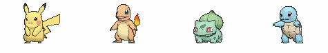

# Lyef Pokemon
[](https://travis-ci.org/lyef/lyef-pokemon)


[](http://badges.enytc.com/for/npm/lyef-pokemon)



> A react component show any pokemon from different generations.

## Demo

[Live examples](https://lyef.github.io/lyef-pokemon)

## Installation

```sh
$ npm install --save lyef-pokemon
```

*Remember to import the styles on `css/main.css` folder to your project.*

## Basic Usage

```jsx
import Pokemon from 'lyef-pokemon';

...
render() {
    return (
        <Pokemon name="pikachu" gen="black-white" label />
    );
}
...
```

## Props

- `name` (string) - pokemon name - *required*
- `gen` (string) - generation ['xy', 'black-white', 'diamond-pearl', 'emerald', 'silver', 'green']
- `label` (bool) - show pokemon name

## Architecture

We've developed this component using the following boilerplate:
[lyef-react-component](https://github.com/lyef/lyef-react-component).

To know more about the architecture or if you want to contribute with this component:
[Contributing Documentation](https://github.com/lyef/lyef-pokemon/blob/master/CONTRIBUTING.md).

## License

[MIT License](https://github.com/lyef/lyef-pokemon/blob/master/LICENSE.md) @ [lyef](https://lyef.github.io/)
